# Noor Safar — Context Graph

_Auto-generated by `scripts/context_graph.py` on 2026-07-29 at commit `3a2a974`. Do not edit by hand — regenerate with `python3 scripts/context_graph.py` (a pre-commit hook keeps it current)._

## System graph

Edges are derived from real imports and `/api/*` call sites. Frontend lib/hook nodes are shown only when they call the backend; page→module edges for purely-local libs are listed in the tables below.

```mermaid
flowchart LR
  subgraph FE[Frontend — Next.js]
    direction TB
    pg__["/"]
    pg__account["/account"]
    pg__ask["/ask"]
    pg__duas["/duas"]
    pg__hadith["/hadith"]
    pg__hadith_of_day["/hadith-of-day"]
    pg__hadith_of_day__date_["/hadith-of-day/[date]"]
    pg__hero_preview["/hero-preview"]
    pg__khutba["/khutba"]
    pg__learn_quran["/learn-quran"]
    pg__learn_quran__lessonId_["/learn-quran/[lessonId]"]
    pg__learn_quran_module_quiz__moduleId_["/learn-quran/module-quiz/[moduleId]"]
    pg__learn_quran_test["/learn-quran/test"]
    pg__library["/library"]
    pg__library__slug_["/library/[slug]"]
    pg__quran["/quran"]
    pg__quran__surah_["/quran/[surah]"]
    pg__quran_listen["/quran/listen"]
    pg__quran_listen__surah_["/quran/listen/[surah]"]
    pg__recite["/recite"]
    pg__settings["/settings"]
    pg__travel_duas["/travel-duas"]
    fe_hooks_useSalah(["hooks/useSalah"])
    fe_hooks_useSurahAudio(["hooks/useSurahAudio"])
    fe_lib_auth(["lib/auth"])
    fe_lib_hadith_of_day(["lib/hadith-of-day"])
    fe_lib_user_prefs(["lib/user-prefs"])
    fe_embed(["/api/embed (Next route)"])
  end
  subgraph BE[Backend — FastAPI]
    direction TB
    be_auth["api/auth<br/><small>/api/auth</small>"]
    be_duas["api/duas<br/><small>/api/duas</small>"]
    be_hadith["api/hadith<br/><small>/api/hadith</small>"]
    be_hadith_topics["api/hadith_topics<br/><small>helper, not mounted</small>"]
    be_khutba["api/khutba<br/><small>/api/khutba</small>"]
    be_quran["api/quran<br/><small>/api/quran</small>"]
    be_rag["api/rag<br/><small>/api/rag</small>"]
    be_recite["api/recite<br/><small>/api/recite</small>"]
    be_salah["api/salah<br/><small>/api/salah</small>"]
    be_tts["api/tts<br/><small>/api/tts</small>"]
    sv_answer_validator(["services/answer_validator"])
    sv_cache(["services/cache"])
    sv_embedding_service(["services/embedding_service"])
    sv_hybrid_retriever(["services/hybrid_retriever"])
    sv_keyword_search(["services/keyword_search"])
    sv_khutbah_match(["services/khutbah_match"])
    sv_query_analyzer(["services/query_analyzer"])
    sv_query_expansion(["services/query_expansion"])
    sv_rag_service(["services/rag_service"])
    sv_retrieval(["services/retrieval"])
    sv_tts_service(["services/tts_service"])
  end
  DB[("Postgres+pgvector / SQLite<br/>document_chunks")]
  pg__ --> fe_lib_auth
  pg__ --> fe_lib_user_prefs
  pg__ --> fe_hooks_useSalah
  pg__account --> fe_lib_auth
  pg__account --> fe_lib_user_prefs
  pg__duas --> fe_lib_user_prefs
  pg__hadith --> fe_lib_user_prefs
  pg__hadith_of_day --> fe_lib_hadith_of_day
  pg__hadith_of_day --> fe_lib_user_prefs
  pg__hadith_of_day__date_ --> fe_lib_hadith_of_day
  pg__hero_preview --> fe_lib_user_prefs
  pg__khutba --> fe_lib_user_prefs
  pg__learn_quran --> fe_lib_user_prefs
  pg__learn_quran__lessonId_ --> fe_lib_user_prefs
  pg__learn_quran_module_quiz__moduleId_ --> fe_lib_user_prefs
  pg__learn_quran_test --> fe_lib_user_prefs
  pg__library --> fe_lib_user_prefs
  pg__quran --> fe_lib_user_prefs
  pg__quran__surah_ --> fe_lib_user_prefs
  pg__quran__surah_ --> fe_hooks_useSurahAudio
  pg__recite --> fe_lib_user_prefs
  pg__settings --> fe_lib_user_prefs
  pg__settings --> fe_hooks_useSalah
  pg__ --> be_duas
  pg__ --> be_hadith
  pg__ --> be_quran
  pg__ --> be_rag
  pg__ --> be_salah
  pg__duas --> be_duas
  pg__hadith --> be_hadith
  pg__hadith_of_day --> be_hadith
  pg__khutba --> be_khutba
  pg__quran --> be_quran
  pg__quran__surah_ --> be_quran
  pg__recite --> be_quran
  pg__recite --> be_recite
  pg__settings --> be_salah
  fe_hooks_useSalah --> be_salah
  fe_hooks_useSurahAudio --> be_quran
  fe_lib_auth --> be_auth
  fe_lib_hadith_of_day --> be_hadith
  fe_lib_user_prefs --> be_auth
  be_hadith -.->|imports| be_hadith_topics
  be_khutba --> sv_khutbah_match
  be_rag --> sv_rag_service
  be_recite -.->|imports| be_khutba
  be_tts --> sv_tts_service
  sv_answer_validator --> sv_query_expansion
  sv_hybrid_retriever --> sv_embedding_service
  sv_keyword_search --> sv_query_expansion
  sv_rag_service --> sv_answer_validator
  sv_rag_service --> sv_cache
  sv_rag_service --> sv_hybrid_retriever
  sv_rag_service --> sv_keyword_search
  sv_rag_service --> sv_query_analyzer
  sv_rag_service --> sv_query_expansion
  sv_rag_service --> sv_retrieval
  sv_retrieval --> sv_hybrid_retriever
  sv_retrieval --> sv_keyword_search
  sv_retrieval --> sv_query_expansion
  be_auth --> DB
  be_duas --> DB
  be_hadith --> DB
  be_khutba --> DB
  be_quran --> DB
  be_recite --> DB
  sv_cache --> DB
  sv_hybrid_retriever --> DB
  sv_keyword_search --> DB
  sv_khutbah_match --> DB
  sv_retrieval --> DB
```

## Frontend routes

| Route | Shared modules used | API endpoints referenced |
|---|---|---|
| `/` | `hooks/useSalah`, `lib/a11y`, `lib/api`, `lib/auth`, `lib/gratitude-journal`, `lib/hadith-topics`, `lib/i18n`, `lib/khutba-history`, `lib/library`, `lib/logo-data`, `lib/native-bridge`, `lib/notification-prefs`, `lib/notification-schedule`, `lib/quran-bookmarks`, `lib/quran-display`, `lib/salah`, `lib/salah-streak`, `lib/seo`, `lib/surah-meta`, `lib/user-prefs` | `/api/duas`, `/api/hadith`, `/api/quran`, `/api/rag`, `/api/salah` |
| `/account` | `lib/auth`, `lib/i18n`, `lib/learn-quran`, `lib/user-prefs` | — |
| `/ask` | — | — |
| `/duas` | `lib/api`, `lib/i18n`, `lib/seo`, `lib/user-prefs` | `/api/duas` |
| `/hadith` | `lib/api`, `lib/hadith-library`, `lib/hadith-topics`, `lib/i18n`, `lib/seo`, `lib/user-prefs` | `/api/hadith` |
| `/hadith-of-day` | `lib/api`, `lib/hadith-library`, `lib/hadith-of-day`, `lib/hadith-topics`, `lib/i18n`, `lib/seo`, `lib/user-prefs` | `/api/hadith` |
| `/hadith-of-day/[date]` | `lib/hadith-of-day`, `lib/seo` | — |
| `/hero-preview` | `lib/i18n`, `lib/native-bridge`, `lib/notification-prefs`, `lib/notification-schedule`, `lib/salah`, `lib/salah-streak`, `lib/user-prefs` | — |
| `/khutba` | `lib/api`, `lib/html`, `lib/i18n`, `lib/khutba-history`, `lib/seo`, `lib/user-prefs` | `/api/khutba` |
| `/learn-quran` | `lib/i18n`, `lib/learn-quran`, `lib/seo`, `lib/user-prefs` | — |
| `/learn-quran/[lessonId]` | `lib/i18n`, `lib/learn-quran`, `lib/user-prefs` | — |
| `/learn-quran/module-quiz/[moduleId]` | `lib/i18n`, `lib/learn-quran`, `lib/user-prefs` | — |
| `/learn-quran/test` | `lib/i18n`, `lib/learn-quran`, `lib/user-prefs` | — |
| `/library` | `lib/i18n`, `lib/library-categories`, `lib/library-slug`, `lib/seo`, `lib/user-prefs` | — |
| `/library/[slug]` | `lib/library`, `lib/library-categories`, `lib/seo` | — |
| `/quran` | `lib/api`, `lib/i18n`, `lib/quran-bookmarks`, `lib/quran-display`, `lib/seo`, `lib/user-prefs` | `/api/quran` |
| `/quran/[surah]` | `hooks/useSurahAudio`, `lib/api`, `lib/i18n`, `lib/library`, `lib/quran-bookmarks`, `lib/quran-display`, `lib/quran-types`, `lib/seo`, `lib/surah-library-tags`, `lib/surah-meta`, `lib/tafsir`, `lib/user-prefs` | `/api/quran` |
| `/quran/listen` | — | — |
| `/quran/listen/[surah]` | — | — |
| `/recite` | `lib/api`, `lib/i18n`, `lib/quran-display`, `lib/quran-types`, `lib/seo`, `lib/user-prefs` | `/api/quran`, `/api/recite` |
| `/settings` | `hooks/useSalah`, `lib/a11y`, `lib/api`, `lib/i18n`, `lib/native-bridge`, `lib/notification-prefs`, `lib/notification-schedule`, `lib/salah`, `lib/user-prefs` | `/api/salah` |
| `/travel-duas` | — | — |

## Backend routers

| Router | Mounted at | Services used | DB |
|---|---|---|---|
| `api/auth` | `/api/auth` | — | ✓ |
| `api/duas` | `/api/duas` | — | ✓ |
| `api/hadith` | `/api/hadith` | — · imports `api/hadith_topics` | ✓ |
| `api/hadith_topics` | not mounted (helper module) | — | — |
| `api/khutba` | `/api/khutba` | `khutbah_match` | ✓ |
| `api/quran` | `/api/quran` | — | ✓ |
| `api/quran_audio` | `/api/quran/audio` | — | — |
| `api/rag` | `/api/rag` | `rag_service` | — |
| `api/recite` | `/api/recite` | — · imports `api/khutba` | ✓ |
| `api/salah` | `/api/salah` | — | — |
| `api/tts` | `/api/tts` | `tts_service` | — |

## Backend services

| Service | Depends on | DB |
|---|---|---|
| `services/answer_validator` | `query_expansion` | — |
| `services/cache` | — | ✓ |
| `services/embedding_service` | — | — |
| `services/hybrid_retriever` | `embedding_service` | ✓ |
| `services/keyword_search` | `query_expansion` | ✓ |
| `services/khutbah_match` | — | ✓ |
| `services/query_analyzer` | — | — |
| `services/query_expansion` | — | — |
| `services/rag_service` | `answer_validator`, `cache`, `hybrid_retriever`, `keyword_search`, `query_analyzer`, `query_expansion`, `retrieval` | — |
| `services/retrieval` | `hybrid_retriever`, `keyword_search`, `query_expansion` | ✓ |
| `services/transliteration_hi` | — | — |
| `services/tts_service` | — | — |

## Recent commits (last 15)

| Commit | Date | Subject | Areas touched |
|---|---|---|---|
| `3a2a974` | 2026-07-29 | feat: full technical SEO — per-page metadata, sitemap, robots, JSON-LD, OG image | components, docs, frontend misc, lib/seo, lib/surah-meta, page /account, page /duas, page /hadith, page /hadith-of-day, page /hero-preview, page /khutba, page /learn-quran, page /library, page /quran, page /recite, page /settings |
| `33e5aee` | 2026-07-29 | docs: refresh CLAUDE.md — recite router, khutbah matching, migrations, new pages | docs, repo root |
| `0a8c028` | 2026-07-26 | feat: YouTube-style autoplay toggle on the reader toolbar | components, page /quran |
| `4d3413e` | 2026-07-26 | fix: show gregorian month on each hijri calendar cell | components |
| `cc09d51` | 2026-07-26 | feat: auto-play next surah, khutba auto-save + hijri calendar, loading-bar fixes | components, frontend misc, hooks/useSurahAudio, lib/i18n, lib/khutba-history, lib/learn-quran, lib/salah, page /khutba, page /learn-quran, page /library, page /quran |
| `77da022` | 2026-07-19 | chore: restore linting with ESLint 9 flat config (Next 16 removed next lint) | components, frontend misc, lib/quran-audio, lib/salah, page /api, page /duas, page /learn-quran, page /recite |
| `ef6f4b2` | 2026-07-19 | feat: verse loop (hifz), recitation scoring page, word-sync/autoscroll/loading-bar fixes | backend api/recite, backend core, components, frontend misc, hooks/useSurahAudio, lib/api, lib/i18n, lib/quran-audio, page /khutba, page /quran, page /recite |
| `2222a4b` | 2026-07-13 | fix/dark mode reset & saved toast fix in light mode | backend api/auth, components, frontend misc, hooks/useSalah, lib/auth, lib/i18n, lib/notification-prefs, lib/user-prefs, migrations, page /settings |
| `d247230` | 2026-07-13 | fix/added current vs newtime sync with local time | components, frontend misc, lib/i18n, lib/salah, page /settings |
| `d728a45` | 2026-07-11 | Render the mobile More sheet in a portal so it overlays correctly. | components, frontend misc |
| `9fe2bc9` | 2026-07-11 | Fix hadith-of-the-day variety and full bug-audit pass across app. | backend api/auth, backend api/hadith, backend api/hadith_topics, backend api/khutba, backend api/quran, backend api/quran_audio, backend api/rag, backend api/salah, backend core, backend services/embedding_service, backend services/rag_service, components, frontend misc, hooks/useSalah, hooks/useSurahAudio, lib/a11y, lib/auth, lib/gratitude-journal, lib/hadith-library, lib/hadith-topics, lib/i18n, lib/learn-quran, lib/notification-prefs, lib/notification-schedule, lib/quran-audio, lib/quran-bookmarks, lib/quran-display, lib/salah, lib/salah-streak, page /hadith, page /hadith-of-day, page /khutba, page /learn-quran, page /quran, page /settings, repo root |
| `2aa6e05` | 2026-07-05 | Open library answers inline under the tapped question; fix stuck search states. | page /hadith, page /library, page /quran |
| `3e6a3d7` | 2026-07-05 | Add 71 hand-written Q&A: misconceptions, doubt, science, Jesus, converts. | frontend misc, ingestion, page /library |
| `a31fde6` | 2026-07-04 | Add accounts with cloud-synced learning, placement test and course trail. | backend api/auth, backend core, components, frontend misc, ingestion, lib/auth, lib/i18n, lib/learn-quran, migrations, page /account, page /duas, page /learn-quran |
| `00f164a` | 2026-07-04 | Double the Learn Quran course and fix quizzes, examples, word-by-word. | frontend misc, ingestion |

_Stats: 22 frontend routes · 11 backend routers · 12 services · 30 lib modules._
