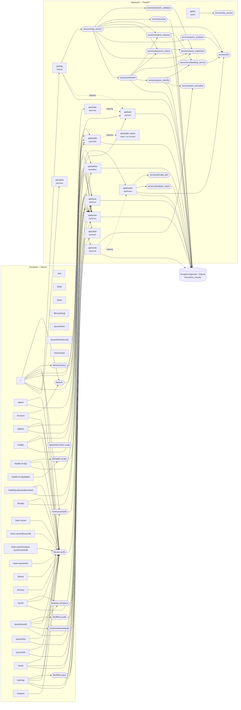

# Noor Safar — Context Graph

_Auto-generated by `scripts/context_graph.py` on 2026-10-09 at commit `cded4b6`. Do not edit by hand — regenerate with `python3 scripts/context_graph.py` (a pre-commit hook keeps it current)._

## System graph

Edges are derived from real imports and `/api/*` call sites. Frontend lib/hook nodes are shown only when they call the backend; page→module edges for purely-local libs are listed in the tables below.

```mermaid
flowchart LR
  subgraph FE[Frontend — Next.js]
    direction TB
    pg__["/"]
    pg__about["/about"]
    pg__account["/account"]
    pg__adhkar["/adhkar"]
    pg__ask["/ask"]
    pg__dhikr["/dhikr"]
    pg__duas["/duas"]
    pg__hadith["/hadith"]
    pg__hadith_of_day["/hadith-of-day"]
    pg__hadith_of_day__date_["/hadith-of-day/[date]"]
    pg__hadith__collection___number_["/hadith/[collection]/[number]"]
    pg__khutba["/khutba"]
    pg__learn_quran["/learn-quran"]
    pg__learn_quran__lessonId_["/learn-quran/[lessonId]"]
    pg__learn_quran_module_quiz__moduleId_["/learn-quran/module-quiz/[moduleId]"]
    pg__learn_quran_test["/learn-quran/test"]
    pg__library["/library"]
    pg__library__slug_["/library/[slug]"]
    pg__privacy["/privacy"]
    pg__quran["/quran"]
    pg__quran__surah_["/quran/[surah]"]
    pg__quran_find["/quran/find"]
    pg__quran_hifz["/quran/hifz"]
    pg__quran_listen["/quran/listen"]
    pg__quran_listen__surah_["/quran/listen/[surah]"]
    pg__recite["/recite"]
    pg__settings["/settings"]
    pg__support["/support"]
    pg__travel_duas["/travel-duas"]
    fe_hooks_useSalah(["hooks/useSalah"])
    fe_hooks_useSurahAudio(["hooks/useSurahAudio"])
    fe_lib_auth(["lib/auth"])
    fe_lib_chat_history(["lib/chat-history"])
    fe_lib_hadith_of_day(["lib/hadith-of-day"])
    fe_lib_offline_audio(["lib/offline-audio"])
    fe_lib_offline_pack(["lib/offline-pack"])
    fe_lib_quran_durations(["lib/quran-durations"])
    fe_lib_user_prefs(["lib/user-prefs"])
    fe_embed(["/api/embed (Next route)"])
  end
  subgraph BE[Backend — FastAPI]
    direction TB
    be_adhkar["api/adhkar<br/><small>/api/adhkar</small>"]
    be_auth["api/auth<br/><small>/api/auth</small>"]
    be_chats["api/chats<br/><small>/api/chats</small>"]
    be_duas["api/duas<br/><small>/api/duas</small>"]
    be_hadith["api/hadith<br/><small>/api/hadith</small>"]
    be_hadith_topics["api/hadith_topics<br/><small>helper, not mounted</small>"]
    be_khutba["api/khutba<br/><small>/api/khutba</small>"]
    be_quran["api/quran<br/><small>/api/quran</small>"]
    be_rag["api/rag<br/><small>/api/rag</small>"]
    be_recite["api/recite<br/><small>/api/recite</small>"]
    be_salah["api/salah<br/><small>/api/salah</small>"]
    be_tts["api/tts<br/><small>/api/tts</small>"]
    be_zakat["api/zakat<br/><small>/api/zakat</small>"]
    sv_answer_validator(["services/answer_validator"])
    sv_cache(["services/cache"])
    sv_embedding_service(["services/embedding_service"])
    sv_hybrid_retriever(["services/hybrid_retriever"])
    sv_keyword_search(["services/keyword_search"])
    sv_khutba_pdf(["services/khutba_pdf"])
    sv_khutbah_match(["services/khutbah_match"])
    sv_llm(["services/llm"])
    sv_query_analyzer(["services/query_analyzer"])
    sv_query_expansion(["services/query_expansion"])
    sv_quran_identify(["services/quran_identify"])
    sv_rag_service(["services/rag_service"])
    sv_retrieval(["services/retrieval"])
    sv_text_normalize(["services/text_normalize"])
    sv_tts_service(["services/tts_service"])
  end
  DB[("Postgres+pgvector / SQLite<br/>document_chunks")]
  pg__ --> fe_lib_auth
  pg__ --> fe_lib_chat_history
  pg__ --> fe_lib_user_prefs
  pg__ --> fe_hooks_useSalah
  pg__about --> fe_lib_user_prefs
  pg__account --> fe_lib_auth
  pg__account --> fe_lib_user_prefs
  pg__adhkar --> fe_lib_user_prefs
  pg__hadith --> fe_lib_user_prefs
  pg__hadith_of_day --> fe_lib_hadith_of_day
  pg__hadith_of_day --> fe_lib_user_prefs
  pg__hadith_of_day__date_ --> fe_lib_hadith_of_day
  pg__hadith__collection___number_ --> fe_lib_user_prefs
  pg__khutba --> fe_lib_user_prefs
  pg__learn_quran --> fe_lib_user_prefs
  pg__learn_quran__lessonId_ --> fe_lib_user_prefs
  pg__learn_quran_module_quiz__moduleId_ --> fe_lib_user_prefs
  pg__learn_quran_test --> fe_lib_user_prefs
  pg__library --> fe_lib_user_prefs
  pg__privacy --> fe_lib_user_prefs
  pg__quran --> fe_lib_quran_durations
  pg__quran --> fe_lib_user_prefs
  pg__quran__surah_ --> fe_lib_offline_audio
  pg__quran__surah_ --> fe_lib_quran_durations
  pg__quran__surah_ --> fe_lib_user_prefs
  pg__quran__surah_ --> fe_hooks_useSurahAudio
  pg__quran_find --> fe_lib_user_prefs
  pg__quran_hifz --> fe_lib_user_prefs
  pg__recite --> fe_lib_user_prefs
  pg__settings --> fe_lib_offline_pack
  pg__settings --> fe_lib_user_prefs
  pg__settings --> fe_hooks_useSalah
  pg__support --> fe_lib_user_prefs
  pg__ --> be_duas
  pg__ --> be_hadith
  pg__ --> be_quran
  pg__ --> be_rag
  pg__ --> be_zakat
  pg__about --> be_quran
  pg__adhkar --> be_adhkar
  pg__adhkar --> be_quran
  pg__hadith --> be_duas
  pg__hadith --> be_hadith
  pg__hadith_of_day --> be_hadith
  pg__hadith__collection___number_ --> be_hadith
  pg__khutba --> be_khutba
  pg__quran --> be_quran
  pg__quran__surah_ --> be_quran
  pg__quran_find --> be_quran
  pg__quran_hifz --> be_quran
  pg__recite --> be_quran
  pg__recite --> be_recite
  pg__settings --> be_duas
  pg__settings --> be_salah
  fe_hooks_useSalah --> be_salah
  fe_hooks_useSurahAudio --> be_quran
  fe_lib_auth --> be_auth
  fe_lib_chat_history --> be_chats
  fe_lib_hadith_of_day --> be_hadith
  fe_lib_offline_audio --> be_quran
  fe_lib_offline_pack --> be_adhkar
  fe_lib_offline_pack --> be_duas
  fe_lib_offline_pack --> be_quran
  fe_lib_quran_durations --> be_quran
  fe_lib_user_prefs --> be_auth
  be_chats -.->|imports| be_auth
  be_hadith -.->|imports| be_hadith_topics
  be_khutba --> sv_khutba_pdf
  be_khutba --> sv_khutbah_match
  be_khutba --> sv_llm
  be_rag --> sv_rag_service
  be_rag -.->|imports| be_auth
  be_recite --> sv_text_normalize
  be_recite -.->|imports| be_khutba
  be_tts --> sv_tts_service
  sv_answer_validator --> sv_query_expansion
  sv_embedding_service --> sv_llm
  sv_hybrid_retriever --> sv_embedding_service
  sv_keyword_search --> sv_query_expansion
  sv_query_analyzer --> sv_llm
  sv_quran_identify --> sv_embedding_service
  sv_quran_identify --> sv_text_normalize
  sv_rag_service --> sv_answer_validator
  sv_rag_service --> sv_cache
  sv_rag_service --> sv_hybrid_retriever
  sv_rag_service --> sv_keyword_search
  sv_rag_service --> sv_llm
  sv_rag_service --> sv_query_analyzer
  sv_rag_service --> sv_query_expansion
  sv_rag_service --> sv_retrieval
  sv_retrieval --> sv_hybrid_retriever
  sv_retrieval --> sv_keyword_search
  sv_retrieval --> sv_query_expansion
  sv_retrieval --> sv_quran_identify
  be_adhkar --> DB
  be_auth --> DB
  be_duas --> DB
  be_hadith --> DB
  be_khutba --> DB
  be_quran --> DB
  be_rag --> DB
  be_recite --> DB
  sv_cache --> DB
  sv_hybrid_retriever --> DB
  sv_keyword_search --> DB
  sv_khutbah_match --> DB
  sv_quran_identify --> DB
  sv_retrieval --> DB
```

## Frontend routes

| Route | Shared modules used | API endpoints referenced |
|---|---|---|
| `/` | `hooks/useSalah`, `lib/a11y`, `lib/api`, `lib/apk`, `lib/auth`, `lib/chat-feedback`, `lib/chat-history`, `lib/chat-history-model`, `lib/chat-stream`, `lib/citation-links`, `lib/featured-verses`, `lib/hadith-topics`, `lib/i18n`, `lib/library`, `lib/logo-data`, `lib/native-bridge`, `lib/nav`, `lib/notification-prefs`, `lib/notification-schedule`, `lib/quran-bookmarks`, `lib/quran-display`, `lib/ramadan`, `lib/salah`, `lib/salah-streak`, `lib/seo`, `lib/share`, `lib/surah-meta`, `lib/user-prefs`, `lib/zakat` | `/api/duas`, `/api/hadith`, `/api/quran`, `/api/rag`, `/api/zakat` |
| `/about` | `lib/api`, `lib/featured-verses`, `lib/i18n`, `lib/logo-data`, `lib/quran-display`, `lib/salah`, `lib/seo`, `lib/user-prefs` | `/api/quran` |
| `/account` | `lib/auth`, `lib/i18n`, `lib/learn-quran`, `lib/user-prefs` | — |
| `/adhkar` | `lib/api`, `lib/dhikr-library`, `lib/i18n`, `lib/media-session`, `lib/seo`, `lib/share`, `lib/user-prefs` | `/api/adhkar`, `/api/quran` |
| `/ask` | — | — |
| `/dhikr` | — | — |
| `/duas` | — | — |
| `/hadith` | `lib/api`, `lib/citation-links`, `lib/hadith-library`, `lib/hadith-topics`, `lib/i18n`, `lib/seo`, `lib/share`, `lib/user-prefs` | `/api/duas`, `/api/hadith` |
| `/hadith-of-day` | `lib/api`, `lib/hadith-library`, `lib/hadith-of-day`, `lib/hadith-topics`, `lib/i18n`, `lib/seo`, `lib/share`, `lib/user-prefs` | `/api/hadith` |
| `/hadith-of-day/[date]` | `lib/hadith-of-day`, `lib/i18n`, `lib/seo`, `lib/share` | — |
| `/hadith/[collection]/[number]` | `lib/api`, `lib/i18n`, `lib/seo`, `lib/share`, `lib/user-prefs` | `/api/hadith` |
| `/khutba` | `lib/api`, `lib/html`, `lib/i18n`, `lib/khutba-history`, `lib/khutba-pdf`, `lib/seo`, `lib/user-prefs` | `/api/khutba` |
| `/learn-quran` | `lib/i18n`, `lib/learn-quran`, `lib/seo`, `lib/user-prefs` | — |
| `/learn-quran/[lessonId]` | `lib/i18n`, `lib/learn-quran`, `lib/user-prefs` | — |
| `/learn-quran/module-quiz/[moduleId]` | `lib/i18n`, `lib/learn-quran`, `lib/user-prefs` | — |
| `/learn-quran/test` | `lib/i18n`, `lib/learn-quran`, `lib/user-prefs` | — |
| `/library` | `lib/i18n`, `lib/library-categories`, `lib/library-shards`, `lib/library-slug`, `lib/seo`, `lib/user-prefs` | — |
| `/library/[slug]` | `lib/i18n`, `lib/library`, `lib/library-categories`, `lib/seo`, `lib/share` | — |
| `/privacy` | `lib/i18n`, `lib/seo`, `lib/user-prefs` | — |
| `/quran` | `lib/api`, `lib/i18n`, `lib/quran-bookmarks`, `lib/quran-display`, `lib/quran-durations`, `lib/seo`, `lib/user-prefs` | `/api/quran` |
| `/quran/[surah]` | `hooks/useSurahAudio`, `lib/api`, `lib/i18n`, `lib/library`, `lib/native-bridge`, `lib/offline-audio`, `lib/quran-bookmarks`, `lib/quran-display`, `lib/quran-durations`, `lib/quran-types`, `lib/seo`, `lib/share`, `lib/surah-library-tags`, `lib/surah-meta`, `lib/tafsir`, `lib/user-prefs` | `/api/quran` |
| `/quran/find` | `lib/api`, `lib/i18n`, `lib/ocr`, `lib/quran-display`, `lib/user-prefs` | `/api/quran` |
| `/quran/hifz` | `lib/api`, `lib/hifz`, `lib/i18n`, `lib/quran-display`, `lib/quran-types`, `lib/seo`, `lib/user-prefs` | `/api/quran` |
| `/quran/listen` | — | — |
| `/quran/listen/[surah]` | — | — |
| `/recite` | `lib/api`, `lib/hifz`, `lib/i18n`, `lib/quran-display`, `lib/quran-types`, `lib/seo`, `lib/user-prefs` | `/api/quran`, `/api/recite` |
| `/settings` | `hooks/useSalah`, `lib/a11y`, `lib/api`, `lib/gratitude-journal`, `lib/i18n`, `lib/native-bridge`, `lib/notification-prefs`, `lib/notification-schedule`, `lib/offline-pack`, `lib/salah`, `lib/user-prefs` | `/api/duas`, `/api/salah` |
| `/support` | `lib/i18n`, `lib/user-prefs` | — |
| `/travel-duas` | — | — |

## Backend routers

| Router | Mounted at | Services used | DB |
|---|---|---|---|
| `api/adhkar` | `/api/adhkar` | — | ✓ |
| `api/auth` | `/api/auth` | — | ✓ |
| `api/chats` | `/api/chats` | — · imports `api/auth` | — |
| `api/duas` | `/api/duas` | — | ✓ |
| `api/hadith` | `/api/hadith` | — · imports `api/hadith_topics` | ✓ |
| `api/hadith_topics` | not mounted (helper module) | — | — |
| `api/khutba` | `/api/khutba` | `khutba_pdf`, `khutbah_match`, `llm` | ✓ |
| `api/places` | `/api/places` | — | — |
| `api/quran` | `/api/quran` | — | ✓ |
| `api/quran_audio` | `/api/quran/audio` | — | — |
| `api/rag` | `/api/rag` | `rag_service` · imports `api/auth` | ✓ |
| `api/recite` | `/api/recite` | `text_normalize` · imports `api/khutba` | ✓ |
| `api/salah` | `/api/salah` | — | — |
| `api/tts` | `/api/tts` | `tts_service` | — |
| `api/zakat` | `/api/zakat` | — | — |

## Backend services

| Service | Depends on | DB |
|---|---|---|
| `services/answer_validator` | `query_expansion` | — |
| `services/cache` | — | ✓ |
| `services/chat_history` | — | ✓ |
| `services/embedding_service` | `llm` | — |
| `services/hybrid_retriever` | `embedding_service` | ✓ |
| `services/keyword_search` | `query_expansion` | ✓ |
| `services/khutba_pdf` | — | — |
| `services/khutbah_match` | — | ✓ |
| `services/llm` | — | — |
| `services/query_analyzer` | `llm` | — |
| `services/query_expansion` | — | — |
| `services/quran_identify` | `embedding_service`, `text_normalize` | ✓ |
| `services/rag_service` | `answer_validator`, `cache`, `hybrid_retriever`, `keyword_search`, `llm`, `query_analyzer`, `query_expansion`, `retrieval` | — |
| `services/retrieval` | `hybrid_retriever`, `keyword_search`, `query_expansion`, `quran_identify` | ✓ |
| `services/text_normalize` | — | — |
| `services/transliteration_hi` | — | — |
| `services/tts_service` | — | — |

## Recent commits (last 15)

| Commit | Date | Subject | Areas touched |
|---|---|---|---|
| `cded4b6` | 2026-10-09 | feat(quran): offline-save button next to the surah name | components, docs, lib/i18n, page /quran |
| `401a942` | 2026-10-09 | feat(quran): save a surah's recitation and translation audio for offline listening (APK) | components, docs, frontend misc, hooks/useSurahAudio, lib/i18n, lib/native-bridge, lib/offline-audio, lib/offline-audio-keys, page /quran, repo root |
| `9afd763` | 2026-10-05 | feat(chat): saved chat history with stars for signed-in users | backend api/auth, backend api/chats, backend api/rag, backend core, backend misc, backend services/chat_history, components, docs, frontend misc, lib/chat-history, lib/chat-history-model, lib/chat-stream, lib/i18n, migrations |
| `8003e79` | 2026-10-05 | feat(chat): opening a source is now a rocket launch | components, docs, frontend misc |
| `84dc0e4` | 2026-10-05 | feat(chat): the opening-the-source scene, redesigned as a portal of light | components, docs, frontend misc |
| `5bb0ac0` | 2026-10-05 | fix(quran): citation links open straight on the verse, not the surah's top | components, docs, page /quran |
| `9fae127` | 2026-10-05 | fix(zakat): India's gold/silver duty is 15% since May 2026; add a Refresh button | backend api/zakat, backend misc, components, docs, lib/i18n |
| `e1cca70` | 2026-10-05 | feat(zakat): live gold and silver rates in rupees | backend api/zakat, backend core, backend misc, components, docs, lib/i18n |
| `b7a797c` | 2026-10-05 | test: offline prayer times, zakat, hifz, ramadan and offline pack; fix Umm al-Qura Ramadan Isha | docs, frontend misc, lib/ramadan, lib/salah-offline |
| `10ef404` | 2026-10-05 | feat(zakat): zakat calculator in Quick Tools | components, docs, lib/i18n, lib/zakat |
| `5ac70c0` | 2026-10-05 | feat(ramadan): Ramadan card with sehri/iftar countdown and fasting tracker | components, docs, frontend misc, lib/i18n, lib/ramadan, lib/salah |
| `aa613fd` | 2026-10-05 | feat(hifz): memorisation planner with spaced repetition and Recite checks | docs, lib/hifz, lib/i18n, page /quran, page /recite |
| `466e7dd` | 2026-10-05 | feat(offline): prayer times calculated on the device; downloadable Quran, duas and adhkar | components, docs, frontend misc, hooks/useSalah, lib/i18n, lib/offline-pack, lib/salah, lib/salah-offline, page /settings |
| `59d36da` | 2026-10-05 | feat(share): image cards for verses, hadith and duas from one web renderer | components, docs, frontend misc, lib/native-bridge, lib/quran-display, lib/share, lib/share-card, page /adhkar, page /hadith, page /hadith-of-day, page /quran |
| `bb03877` | 2026-10-05 | perf(salah): prayer times show instantly instead of after a ~10 s GPS wait | docs, frontend misc, hooks/useSalah, lib/salah-cache |

_Stats: 29 frontend routes · 15 backend routers · 17 services · 54 lib modules._
